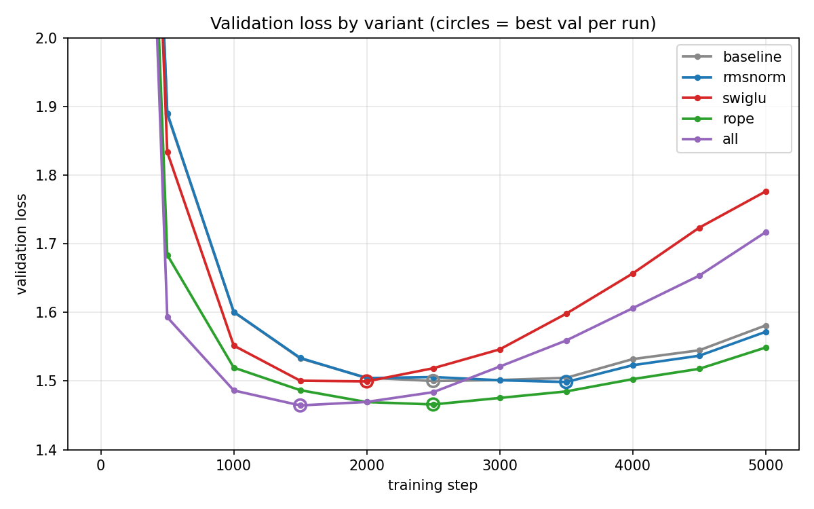

# Modernizing nanoGPT: GPT-2-style → Llama-style, with ablations

Karpathy's [nanoGPT](https://github.com/karpathy/ng-video-lecture) (video-lecture version, ~10.7M params),
upgraded component-by-component to the modern Llama-style stack — **RMSNorm**, **SwiGLU**, and **RoPE** — with a controlled ablation of each change on character-level Shakespeare.

**Headline result:** the fully modernized model reaches a better validation loss than the baseline's
best in roughly **half the training steps** (step ~1000 vs. ~2500). The most interesting single finding
is negative: **SwiGLU optimizes faster but overfits the 1MB dataset**, ending with the worst validation loss of all variants — a small-scale reproduction of why frontier-scale architecture wins don't automatically transfer downward.

## Results

5000 iters, batch 64, context 256, lr 3e-4, single seed (1337), identical batch order across runs.
Hardware: RTX 5060 (8GB, Blackwell — requires PyTorch ≥ 2.7 / CUDA 12.8).

| variant  | params (M) | **best val** | tok/s  | train min |
| -------- | ---------- | ------------ | ------ | --------- |
| baseline | 10.789     | 1.5001       | 98,523 | 13.9      |
| rmsnorm  | 10.784     | 1.4986       | 88,982 | 15.3      |
| swiglu   | 10.777     | 1.4995       | 93,631 | 14.6      |
| rope     | 10.691     | 1.4659       | 97,553 | 14.0      |
| all      | 10.674     | **1.4645**   | 84,637 | 16.1      |



Ranking by **best val** (the early-stopping value — all configs overfit by iter 5000):

- **RoPE is the single most valuable change.** Both RoPE-containing variants (`rope` and `all`) break from the pack at step 500 (1.68 and 1.59 vs ~1.89) and take the top two best-val spots — `all` 1.4645 and `rope` 1.4659, tied within noise (Δ0.0014) and ~0.033 clear of the baseline/rmsnorm/swiglu cluster (all ~1.499–1.500). That ~0.033 gap is the only effect that clears the single-seed noise floor: RoPE encodes relative position from the first step instead of having to learn it.
- **RMSNorm** is a quality wash (best-val Δ0.0015 = noise) and, counter to its usual pitch, ~10% _slower_ here: the hand-rolled version is several eager ops (pow/mean/rsqrt/mul) racing PyTorch's single fused LayerNorm kernel. Its FLOP advantage only becomes speed once fused or at scale. It looked fastest in my earlier compiled run — that was a fusion artifact.
- SwiGLU (and the SwiGLU-containing `all`) drive train loss down hardest — to ~0.61 by iter 5000 — while val climbs back to ~1.78 after its early minimum: pure memorization on a 1MB corpus.
- Throughput is not flat in eager mode (~16% spread). The param/FLOP matching is still exact, but op count and kernel fusion are not — so wall-clock separates the variants. Baseline, built entirely from fused PyTorch builtins (`nn.LayerNorm`, `nn.Linear`+ReLU), is fastest; each modernization adds eager overhead that `torch.compile` would otherwise hide.
- Caveat: single seed; differences under ~0.01–0.02 val loss are noise. The RoPE result survives
  this bar via trajectory dominance; rmsnorm-vs-baseline does not.

## What changed and why

### RMSNorm (replaces LayerNorm) — [Zhang & Sennrich 2019](https://arxiv.org/abs/1910.07467)
Drops mean-centering and the bias; keeps only RMS scaling and a learnable gain.
Same normalization axes as LayerNorm — the difference is the *statistic*, not the geometry. RMSNorm does strictly less arithmetic than LayerNorm (no mean-centering, no bias), but as separate eager ops (pow/mean/rsqrt/mul) it runs ~10% slower here than PyTorch's single fused LayerNorm kernel — the FLOP saving only becomes wall-clock once the ops are fused (`torch.compile`) or at scale. Gradient stabilization is unchanged.


### SwiGLU (replaces the ReLU MLP) — [Shazeer 2020](https://arxiv.org/abs/2002.05202)
Replaces `W2·ReLU(W1·x)` with `W_down·(SiLU(W_gate·x) ⊙ W_up·x)`. Hidden dim is set to
`2/3 · 4 · n_embd` so total FFN weights exactly match the original (`3·d·h = 8d²` — exact here
because `3 | 384`). Biases dropped throughout, Llama-style; that removal is a *separate* design
choice bundled with the gating, worth ~0.1% of parameters. Assuming that the feed-forward network takes $x$ inputs, and $y$ is the original FFN's hidden width (SwiGLU's weight-matched hidden is $2y/3$), the bias dropping **SwiGLUFFN** has $y+x$ parameters less per FFN, whereas with bias parameters, it has $y/3$ more parameters per FFN.  

### RoPE (replaces learned positional embeddings) — [Su et al. 2021](https://arxiv.org/abs/2104.09864)
Rotates q and k per-head, per-layer (never v), by position-dependent angles so attention scores
depend only on *relative* position: `(R_m q)·(R_n k) = qᵀ R_{n−m} k`. Implemented via the complex formulation (`torch.polar` / `view_as_complex`). Deletes the `block_size × n_embd` PE table (−98K params — the bulk of the parameter drop in the table above). Attention scores decay with relative distance ('long-term decay'), biasing the model toward nearby context — structure that learned absolute embeddings would have to discover from data. Although the number of parameters is smaller, the per-layer rotation adds a small elementwise overhead (~1% throughput in the table).


## Reproduce

```bash
wget https://raw.githubusercontent.com/karpathy/char-rnn/master/data/tinyshakespeare/input.txt
pip install -r requirements.txt
python train_ablations.py        # trains all 5 variants serially, ~93 min on an RTX 5060
# `USE_COMPILE = False` by default; these are eager runs
```

Results stream into `results.md` (crash-safe: the summary table is rewritten after every
completed run). Checkpoints for all five variants are on [Hugging Face](https://huggingface.co/Ridwan-1642/nanogpt-modernization-ckpts).


## Bugs I hit (and how I found them)
1. BatchNorm fossils in RMSNorm: As I created my own RMSnorm class, I made mistakes such as using a momentum parameter, a running mean, a bias parameter, using plain tensors instead of the `nn.Parameter`. After going through the actual paper, the paper made clear why momentum, running statistics, and bias don't apply: RMSNorm computes per-sample statistics, so there's nothing to track across batches. Wrapping in `nn.Parameter` is necessary for tracking the gradients together.
2. **SwiGLU parameter counts:** Since **SwiGLUFFN** uses 3 weight matrices instead of the usual 2, a silent issue that I ran into was keeping the layer-sizes the same, resulting in more parameters for **SwiGLUFFN**. Comparing models with a variation in parameter-size is faulty, hence I precisely calculated the required size of the hidden layer.
3. Bias-dimension swap in my parameter-count derivation: Linear bias lives in the OUTPUT space; initially I made the mistake by assuming the bias lives in the input space, which flipped my conclusion. This was caught when I checked the actual parameter counts.
4. RoPE frequency buffer not sliced to sequence length: This bug is invisible at T == block_size, but crashes at generation time. Caught by forwarding a T=7 batch.
5. eps placed outside the sqrt in RMSNorm: This runs fine, but is a different function than every reference implementation. This is a silent bug, caught only by line-by-line comparison against the reference implementation.
6. **Batch order was silently confounded with architecture.** I seeded once with `torch.manual_seed(SEED)` and then built the model — but variants consume different amounts of initial RNG (RoPE skips the PE table, SwiGLU has three weight matrices not two), so by the first `get_batch` the global RNG state, and the batch sequence, differed per variant. The "identical batch order" claim was false; part of what I'd labeled seed noise was uncontrolled data-order variance. Fixed by giving the data loader its own `torch.Generator`, seeded independently and created before model construction. Caught by reasoning about RNG consumption.
7. **"Throughput is flat" was a `torch.compile` artifact.** The original runs compiled the model, which fused my hand-rolled RMSNorm/SwiGLU/RoPE ops and flattened wall-clock to a ~3% spread — leading me to conclude throughput was FLOP-bound and matched. Removing compile for honest, warmup-free timing widened the spread to ~16% and flipped RMSNorm from fastest to ~10% slower than baseline. Param/FLOP-matched is not throughput-matched once I stopped fusing; compiled throughput numbers measure the compiler as much as the architecture.

## Future work

- Dense (per-100-step) loss logging to locate the induction-head phase transition
  ([Olsson et al. 2022](https://arxiv.org/abs/2209.11895)) per variant — do positional encodings shift *when* induction heads form? Checkpoints already saved for this.
- Trainable RoPE frequencies (θ as parameters) as a sixth ablation row.
- Fused multi-head attention via `F.scaled_dot_product_attention` + before/after kernel profile.

## Acknowledgements

Built on Andrej Karpathy's [ng-video-lecture](https://github.com/karpathy/ng-video-lecture) code
(including, faithfully, the `FeedFoward` typo — preserved here as an easter egg, then fixed).
