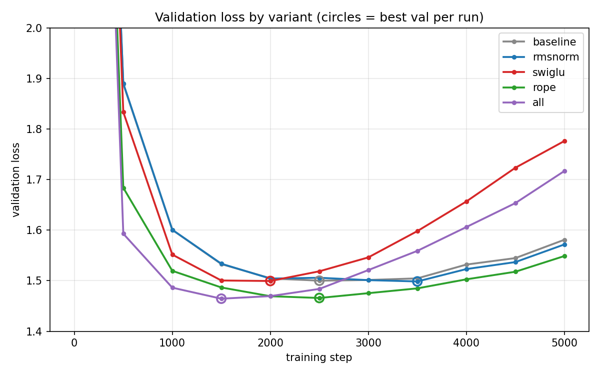

# Modernizing nanoGPT: from GPT-2-style to Llama-style, with ablations

I took Karpathy's [nanoGPT](https://github.com/karpathy/ng-video-lecture) (the video-lecture version, about 10.7M parameters) and upgraded it one component at a time to the modern Llama-style stack: **RMSNorm**, **SwiGLU**, and **RoPE**. Each change gets its own controlled ablation on character-level Shakespeare.

**Headline result:** the fully modernized model beats the baseline's best validation loss in roughly **half the training steps** (around step 1000, versus around 2500 for the baseline). The most interesting single finding is a negative one: **SwiGLU optimizes faster but overfits the 1MB dataset**, and it ends up with the worst validation loss of all the variants. It's a small-scale example of why architecture improvements that win at frontier scale don't automatically carry over to small models.

## Results

All runs use 5000 iterations, batch size 64, context length 256, learning rate 3e-4, a single seed (1337), and the same batch order.
Hardware: RTX 5060 (8GB, Blackwell, which needs PyTorch ≥ 2.7 / CUDA 12.8).

| variant  | params (M) | **best val** | tok/s  | train min |
| -------- | ---------- | ------------ | ------ | --------- |
| baseline | 10.789     | 1.5001       | 98,523 | 13.9      |
| rmsnorm  | 10.784     | 1.4986       | 88,982 | 15.3      |
| swiglu   | 10.777     | 1.4995       | 93,631 | 14.6      |
| rope     | 10.691     | 1.4659       | 97,553 | 14.0      |
| all      | 10.674     | **1.4645**   | 84,637 | 16.1      |



I rank the variants by **best val**, meaning the value you'd get with early stopping, because every configuration has started overfitting by iteration 5000.

- **RoPE is the most valuable single change.** The two variants that include RoPE (`rope` and `all`) pull away from the others by step 500 (1.68 and 1.59, versus about 1.89 for the rest) and take the top two spots on best val: `all` at 1.4645 and `rope` at 1.4659. Those two are tied within noise (Δ0.0014), and both sit about 0.033 ahead of the baseline/rmsnorm/swiglu group (all around 1.499–1.500). That 0.033 gap is the only effect large enough to clear the single-seed noise floor. The likely reason is that RoPE gives the model relative position information from the very first step, instead of making it learn position from scratch.
- **RMSNorm** makes no real difference to quality (a best-val Δ of 0.0015 is noise). Contrary to how it's usually pitched, it's also about 10% _slower_ here. My hand-written version runs as several separate eager ops (pow, mean, rsqrt, mul), and it's competing against PyTorch's single fused LayerNorm kernel. Its FLOP savings only turn into real speed once the ops are fused or the model is large. It looked like the fastest variant in an earlier compiled run, but that turned out to be a side effect of fusion.
- **SwiGLU** (along with `all`, which includes it) pushes train loss down the hardest, to about 0.61 by iteration 5000. Meanwhile, its validation loss climbs back up to about 1.78 after hitting its early minimum. On a 1MB corpus, that's simply memorization.
- **Throughput varies quite a bit in eager mode** (about a 16% spread). The variants are still exactly matched in parameters and FLOPs, but they differ in how many ops they launch and how well those ops fuse, so their wall-clock times diverge. The baseline is built entirely from fused PyTorch builtins (`nn.LayerNorm`, `nn.Linear` + ReLU), so it's the fastest. Each modernization adds some eager overhead that `torch.compile` would normally hide.
- **Caveat:** this is a single seed, so differences smaller than about 0.01–0.02 in validation loss should be treated as noise. The RoPE result passes that bar because its curve stays ahead for the whole run. The rmsnorm-vs-baseline difference does not.

## What changed and why

### RMSNorm (replaces LayerNorm): [Zhang & Sennrich 2019](https://arxiv.org/abs/1910.07467)
RMSNorm removes LayerNorm's mean-centering and bias, keeping only RMS scaling and a learnable gain. It normalizes over the same axes as LayerNorm; what changes is the *statistic* used, not the geometry. In principle RMSNorm does strictly less arithmetic than LayerNorm. In practice, running as separate eager ops (pow, mean, rsqrt, mul), it's about 10% slower here than PyTorch's single fused LayerNorm kernel. The FLOP savings only show up in wall-clock time once the ops are fused (for example with `torch.compile`) or at larger scale. Its stabilizing effect on gradients is the same as LayerNorm's.

### SwiGLU (replaces the ReLU MLP): [Shazeer 2020](https://arxiv.org/abs/2002.05202)
SwiGLU replaces `W2·ReLU(W1·x)` with `W_down·(SiLU(W_gate·x) ⊙ W_up·x)`. Because it uses three weight matrices instead of two, I set the hidden size to `2/3 · 4 · n_embd` so that the total FFN weight count matches the original exactly (`3·d·h = 8d²`). This works out exactly here because 384 is divisible by 3.

Following Llama, I also dropped all biases. That's a *separate* design decision bundled together with the gating, and it accounts for about 0.1% of the parameters. To make this concrete: say the FFN has input width $x$ and the original FFN's hidden width is $y$, so SwiGLU's weight-matched hidden width is $2y/3$. Without biases, the SwiGLU FFN has $y + x$ fewer parameters than the original. If you kept the biases, it would instead have $y/3$ more.

### RoPE (replaces learned positional embeddings): [Su et al. 2021](https://arxiv.org/abs/2104.09864)
RoPE rotates the query and key vectors (but never the values), separately for each head and layer, by angles that depend on position. As a result, attention scores depend only on *relative* position: `(R_m q)·(R_n k) = qᵀ R_{n−m} k`. I implemented it with the complex-number formulation (`torch.polar` / `view_as_complex`).

This removes the `block_size × n_embd` positional embedding table, saving about 98K parameters, which accounts for most of the parameter drop in the table above. RoPE also has a "long-term decay" property: attention scores tend to shrink with relative distance, which nudges the model toward nearby context. Learned absolute embeddings would have to discover that kind of structure from the data. Even though RoPE has fewer parameters, the rotation in every layer adds a small amount of elementwise work, costing about 1% in throughput according to the table.

## Reproduce

```bash
wget https://raw.githubusercontent.com/karpathy/char-rnn/master/data/tinyshakespeare/input.txt
pip install -r requirements.txt
python train_ablations.py        # trains all 5 variants one after another, ~93 min on an RTX 5060
# USE_COMPILE = False by default; these are eager runs
```

Results are written to `results.md` as training progresses. It's crash-safe: the summary table is rewritten after each run finishes. Checkpoints for all five variants are available on [Hugging Face](https://huggingface.co/Ridwan-1642/nanogpt-modernization-ckpts).

## Bugs I hit (and how I found them)
1. **Leftover BatchNorm habits in RMSNorm.** When I wrote my own RMSNorm class, I carried over things that don't belong there: a momentum parameter, a running mean, a bias, and plain tensors where I needed `nn.Parameter`. Reading the paper made it clear why momentum, running statistics, and bias don't apply. RMSNorm computes its statistics per sample, so there's nothing to track across batches. The gain has to be wrapped in `nn.Parameter` so the module registers it and the optimizer actually updates it.
2. **SwiGLU parameter counts.** Since the SwiGLU FFN has three weight matrices instead of two, keeping the hidden size unchanged quietly gave it more parameters than the baseline. Comparing models of different sizes isn't a fair comparison, so I worked out exactly what hidden size was needed to match.
3. **Swapped bias dimensions in my parameter-count math.** A linear layer's bias lives in its *output* space. At first I assumed it lived in the input space, which flipped my conclusion. I caught it by checking against the actual parameter counts.
4. **RoPE frequency buffer not sliced to the sequence length.** This bug is invisible when T == block_size, but it crashes during generation. I caught it by running a forward pass on a batch with T=7.
5. **eps placed outside the square root in RMSNorm.** This runs without errors, but it computes a different function from every reference implementation. Because it fails silently, I only found it by comparing my code line by line against a reference.
6. **Batch order was secretly tied to the architecture.** I called `torch.manual_seed(SEED)` once and then built the model. But the variants use different amounts of random numbers during initialization (RoPE skips the positional embedding table, SwiGLU has three weight matrices instead of two), so by the first `get_batch` call, each variant's global RNG state, and therefore its batch sequence, was different. My "identical batch order" claim was false, and some of what I'd been calling seed noise was really uncontrolled variation in data order. I fixed it by giving the data loader its own `torch.Generator`, seeded independently and created before the model is built. I caught this one by thinking through how much RNG each variant consumes.
7. **"Throughput is flat" was an artifact of `torch.compile`.** My original runs compiled the model, which fused my hand-written RMSNorm, SwiGLU, and RoPE ops and squeezed the wall-clock differences down to about 3%. That led me to conclude that throughput was FLOP-bound and matched across variants. When I removed compilation to get honest, warmup-free timings, the spread grew to about 16%, and RMSNorm went from fastest to about 10% slower than the baseline. Matching parameters and FLOPs doesn't mean matching throughput once the ops aren't fused, and compiled throughput numbers measure the compiler as much as the architecture.

## Future work

- Log loss more densely (every 100 steps) to find the induction-head phase transition ([Olsson et al. 2022](https://arxiv.org/abs/2209.11895)) for each variant, and see whether the choice of positional encoding changes *when* induction heads form. The checkpoints for this are already saved.
- Make the RoPE frequencies (θ) trainable and add that as a sixth ablation row.
- Switch to fused multi-head attention with `F.scaled_dot_product_attention`, with kernel profiles before and after.

## Acknowledgements

Built on Andrej Karpathy's [ng-video-lecture](https://github.com/karpathy/ng-video-lecture) code, including its `FeedFoward` typo, which I faithfully kept as an easter egg before fixing it.
